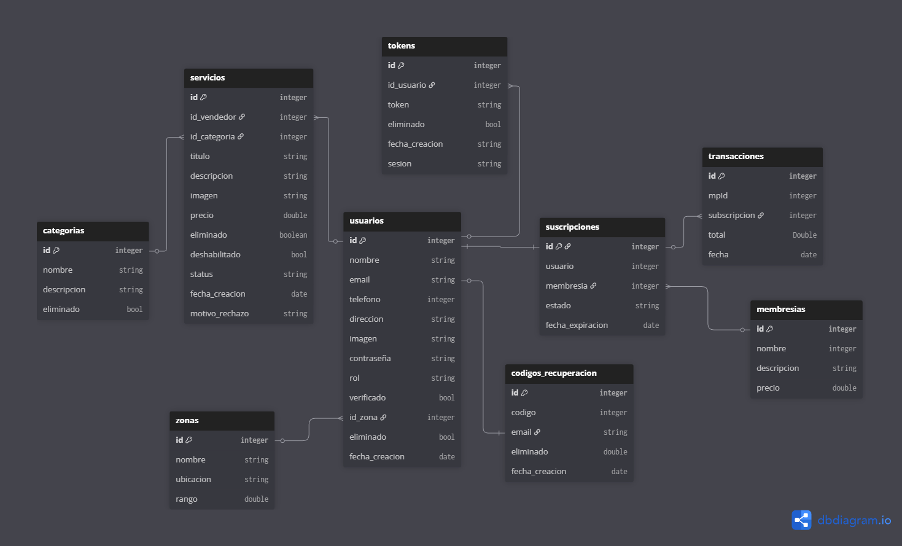
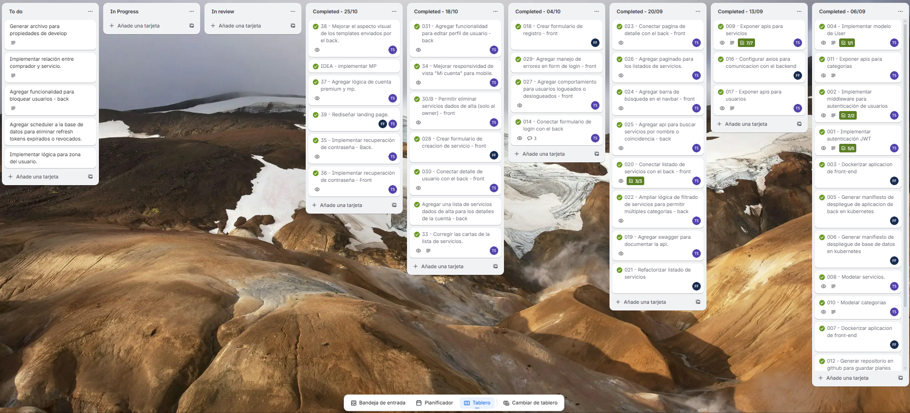

# Service Marketplace - Plataforma de Servicios para Emprendedores y PYMES

## Integrantes
- Thomas Sejas
- Facundo Fleitas

## Actores
### Cliente
- Ver servicios.
- Publicar servicios.
- Contactarse con el vendedor.
- Administrar servicios y cuenta.
- Contratar plan premium para acceder a beneficios.

### Administrador
- Gestionar servicios publicados (Aceptar o Rechazar).
- Acceder a metricas de servicios publicados.
- Gestionar transacciones.

### Mercado Pago
- Procesar los pagos y recurrencias de las suscripciones.

---

## Diagrama de base de datos

---

## Requisitos Funcionales

### RF-01: Registro de usuario
***Descripción:***
El sistema debe permitir que un nuevo usuario se registre ingresando nombre, email, contraseña y, opcionalmente, foto de perfil, dirección y teléfono.

***Criterios de aceptación:***
- El sistema debe validar que el email sea válido y que no se encuentre registrado.
- Si falta un dato obligatorio, debe devolver un mensaje de error.
- Si los datos son correctos, debe hashear la contraseña.
- Si el registro es exitoso, debe devolver un mensaje de éxito y enviar un email de confirmación al correo del usuario.

---

### RF-02: Inicio de sesión
***Descripción:***
El usuario debe poder iniciar sesión.

***Criterios de aceptación:***
- El sistema debe validar los datos de inicio de sesión.
- Si los datos son incorrectos, debe devolver un mensaje de error.
- Si el email no está confirmado, debe devolver un mensaje de error y enviar otro mail de confirmación.
- Si el inicio de sesión es exitoso, debe generar un token de sesión y un refresh token.

---

### RF-03: Gestión de usuarios
***Descripción:***
El usuario debe poder modificar los datos de su cuenta.

***Criterios de aceptación:***
- El usuario podra modificar su contraseña.
- Recuperar su contraseña.
- Modificar su foto de perfíl.
- Modificar su dirección y numero de telefono.

---

### RF-04: Gestión de servicios
***Descripción:***
El usuario debe poder gestionar sus servicios, y el administrador debe poder acceder a funciones privadas.

***Criterios de aceptación:***
- El sistema debe permitir crear, eliminar, editar y ver los servicios.
- El sistema debe permitir a los administradores cambiar el estado de los servicios (Aprobado o Rechazado).
- Los administradores deben poder acceder a endpoints que devuelvan métricas de servicios (cantidad, aprobados, rechazados, etc.).

---

### RF-05: Gestión de categorías
***Descripción:***
El sistema debe permitir a los administradores realizar acciones CRUD sobre las categorías.

***Criterios de aceptación:***
- El sistema debe permitir crear, eliminar, editar y ver las categorías.
- Los administradores deben poder acceder a endpoints que devuelvan métricas de categorías (cantidad total, activas, inactivas, etc.).

---

### RF-06: Gestión de imágenes
***Descripción:***
El sistema debe permitir la gestión de imágenes.

***Criterios de aceptación:***
- Los usuarios deben tener la posibilidad de subir una foto de perfil.
- Los usuarios deben tener la posibilidad de subir una portada para sus servicios.
- El sistema debe devolver un enlace de referencia al subir la imagen.
- Si el usuario modifica su foto de perfil o la portada de un servicio, el sistema debe eliminar la imagen anterior.

---

### RF-07: Gestión de pagos y suscripciones
***Descripción:***
El sistema debe permitir a los usuarios acceder a una suscripción Premium a través de la pasarela de pagos de Mercado Pago.

***Criterios de aceptación:***
- El sistema debe integrarse con Mercado Pago para el cobro de suscripciones.
- Los administradores deben poder ver y crear transacciones pero no modificarlas o eliminarlas.
- El sistema debe contar con un endpoint para recibir notificaciones del estado de la transacción.
- Si el pago es exitoso, el sistema debe asignar el rol Premium al usuario y modificar la fecha de vencimiento de la suscripción.
- Si el pago es rechazado, el sistema debe detectar cuando se vence la suscripción del usuario y modificar su rol al cumplirse el plazo.
- Si el usuario era Premium y tenía tres servicios activos al momento del vencimiento de la suscripción, solo quedará activo el servicio más reciente.

## Requisitos No Funcionales

### RNF-01: Rendimiento
***Descripción:***
El sistema debe ofrecer tiempos de respuesta adecuados para garantizar una buena experiencia de usuario.

***Criterios de aceptación:***
- Las solicitudes al servidor deben responder en menos de 3 segundos en condiciones normales de carga.
- El sistema debe soportar al menos 100 usuarios concurrentes sin pérdida significativa de rendimiento.

---

### RNF-02: Seguridad
***Descripción:***
El sistema debe garantizar la confidencialidad, integridad y disponibilidad de los datos de los usuarios.

***Criterios de aceptación:***
- Las contraseñas deben almacenarse mediante algoritmos de hash seguros (por ejemplo, bcrypt).
- El sistema debe utilizar HTTPS para todas las comunicaciones.
- Solo los usuarios autenticados deben poder acceder a sus datos personales y a los endpoints protegidos.
- Los tokens de autenticación deben tener expiración y posibilidad de renovación segura mediante refresh tokens.

---

### RNF-03: Usabilidad
***Descripción:***
La interfaz debe ser clara, intuitiva y accesible para todo tipo de usuarios.

***Criterios de aceptación:***
- El sistema debe ser responsivo y usable desde dispositivos móviles, tablets y computadoras.
- Los mensajes de error deben ser claros y comprensibles.
- Las secciones principales del sistema deben ser accesibles en un máximo de tres clics desde la pantalla principal.

---

### RNF-04: Mantenibilidad
***Descripción:***
El sistema debe facilitar la modificación, corrección y mejora del código en el futuro.

***Criterios de aceptación:***
- El código debe seguir estándares de desarrollo y convenciones de nombres.
- Debe estar documentado con comentarios claros y actualizados.
- La arquitectura debe ser modular para permitir agregar nuevas funcionalidades sin afectar las existentes.

---

### RNF-05: Disponibilidad
***Descripción:***
El sistema debe estar disponible para los usuarios la mayor parte del tiempo.

***Criterios de aceptación:***
- El sistema debe garantizar una disponibilidad del 99% mensual.
- En caso de fallos, debe recuperarse automáticamente o notificar al administrador.
- Las tareas críticas (como pagos o registros) deben tener mecanismos de recuperación ante errores.

---

### RNF-06: Compatibilidad
***Descripción:***
El sistema debe ser compatible con diferentes navegadores y entornos.

***Criterios de aceptación:***
- Debe funcionar correctamente en los navegadores más utilizados (Google Chrome, Mozilla Firefox, Microsoft Edge y Safari).
- Debe ser compatible con las versiones actuales y dos anteriores de cada navegador.
- Las API deben seguir estándares REST y retornar datos en formato JSON.

---

### RNF-07: Escalabilidad
***Descripción:***
El sistema debe poder adaptarse al crecimiento en la cantidad de usuarios y servicios.

***Criterios de aceptación:***
- La arquitectura debe permitir agregar nuevos servidores o microservicios sin modificar el sistema base.
- La base de datos debe poder manejar un incremento de hasta el 200% en la cantidad de registros sin degradar significativamente el rendimiento.
- El sistema debe poder integrarse fácilmente con servicios externos adicionales.

## Supuestos y Restricciones

### Supuestos
***Descripción:***
Los siguientes puntos representan condiciones que se asumen verdaderas durante el desarrollo y operación del sistema, aunque no estén garantizadas.

***Lista de supuestos:***
- Se asume que los usuarios tienen acceso a Internet estable.
- Se asume que los usuarios utilizan navegadores actualizados y compatibles.
- Se asume que el servicio de correo electrónico (para confirmaciones y notificaciones) estará disponible.
- Se asume que la pasarela de pagos de Mercado Pago funcionará correctamente y de manera continua.
- Se asume que los administradores contarán con conocimientos técnicos básicos para gestionar el sistema.
- Se asume que el servidor y la base de datos estarán alojados en un entorno seguro y confiable.

---

### Restricciones
***Descripción:***
Las restricciones son limitaciones técnicas, legales o de recursos que afectan el desarrollo, implementación o funcionamiento del sistema.

***Lista de restricciones:***
- El sistema debe desarrollarse utilizando **Java (SpringBoot)**.
- La base de datos debe implementarse en **MySql**.
- El sistema debe ponerse en funcionamiento antes del **1 de diciembre de 2025** cumpliendo con el MVP.
- Las integraciones externas (por ejemplo, Mercado Pago o el servicio de envío de correos) deben seguir las políticas y limitaciones de sus respectivas APIs.
- El almacenamiento de imágenes debe realizarse en un servicio seguro (Cloudinary).
- Se debe llevar un registro de todas las transacciones realizadas por los usuarios.
- Los usuarios gratuitos podrán mantener solo 1 servicio activo.
- Los usuarios pagos podrán tener hasta 3 servicios activos.

---

## Matriz de Trazabilidad

***Descripción:***
La siguiente matriz permite rastrear la relación entre los requisitos funcionales (RF), los requisitos no funcionales (RNF) y los casos de uso (CU).
Esto asegura que cada requisito esté correctamente cubierto por el diseño y la implementación del sistema.

| ID del Requisito | Tipo | Descripción | Caso de Uso Relacionado |
|------------------|------|--------------|--------------------------|
| RF-01 | Funcional | Registro de usuario | CU-01: Registro de usuario |
| RF-02 | Funcional | Inicio de sesión | CU-02: Iniciar sesión |
| RF-03 | Funcional | Gestión de usuarios | CU-03: Modificar perfil de usuario |
| RF-04 | Funcional | Gestión de servicios | CU-04: Gestionar servicios |
| RF-05 | Funcional | Gestión de categorías | CU-05: Administrar categorías |
| RF-06 | Funcional | Gestión de imágenes | CU-06: Subir y modificar imágenes |
| RF-07 | Funcional | Gestión de pagos y suscripciones | CU-07: Suscripción Premium |
| RNF-01 | No Funcional | Rendimiento del sistema | General |
| RNF-02 | No Funcional | Seguridad de datos | General |
| RNF-03 | No Funcional | Usabilidad | General |
| RNF-04 | No Funcional | Mantenibilidad | General |
| RNF-05 | No Funcional | Disponibilidad | General |
| RNF-06 | No Funcional | Compatibilidad | General |
| RNF-07 | No Funcional | Escalabilidad | General |

---

***Notas:***
- **CU (Casos de Uso):** Representan las interacciones principales entre los actores y el sistema.
- Cada requisito debe estar vinculado al menos con un caso de uso que lo implemente o lo justifique.

## Casos de Uso

***Descripción:***
Los siguientes casos de uso describen las interacciones entre los actores y el sistema, detallando flujos principales, alternativos y condiciones asociadas.

---

### **CU-01: Registro de usuario**
**Actor principal:** Usuario

**Requisito asociado:** RF-01

**Descripción:** Permite al usuario crear una cuenta ingresando nombre, email, contraseña y datos opcionales.

**Precondiciones:**
- El usuario no debe estar registrado previamente.
- El sistema debe tener conexión a la base de datos.

**Flujo principal:**
1. El usuario accede al formulario de registro.
2. Ingresa nombre, email, contraseña y datos opcionales.
3. El sistema valida el formato del email y la contraseña.
4. El sistema verifica que el email no esté registrado.
5. El sistema almacena los datos y envía un correo de confirmación.
6. El usuario recibe un mensaje de éxito.

**Flujos alternativos:**
- **A1:** Email ya registrado → el sistema muestra mensaje “El email ya se encuentra registrado”.
- **A2:** Formato de email inválido → el sistema muestra error de validación.
- **A3:** Falla en el envío del correo → el sistema registra el error y muestra advertencia.

**Postcondición:**
- El usuario queda registrado como “pendiente de confirmación”.

---

### **CU-02: Inicio de sesión**
**Actor principal:** Usuario

**Requisito asociado:** RF-02

**Descripción:** Permite al usuario autenticarse en el sistema.

**Precondiciones:**
- El usuario debe tener una cuenta registrada y confirmada.

**Flujo principal:**
1. El usuario ingresa email y contraseña.
2. El sistema valida los datos.
3. Si son correctos, genera un token de sesión y un refresh token.
4. El sistema muestra un mensaje de acceso exitoso.

**Flujos alternativos:**
- **A1:** Email no confirmado → el sistema muestra “Email no confirmado” y reenvía correo de activación.
- **A2:** Credenciales incorrectas → el sistema muestra “Email o contraseña incorrectos”.
- **A3:** Cuenta bloqueada → el sistema impide el acceso y muestra “Cuenta suspendida”.

**Postcondición:**
- El usuario queda autenticado y con sesión activa.

---

### **CU-03: Modificar perfil de usuario**
**Actor principal:** Usuario

**Requisito asociado:** RF-03

**Descripción:** Permite al usuario actualizar la información de su cuenta.

**Precondiciones:**
- El usuario debe estar autenticado.

**Flujo principal:**
1. El usuario accede a su perfil.
2. Modifica datos (contraseña, foto, dirección, teléfono).
3. El sistema valida y guarda los cambios.
4. El sistema muestra mensaje de éxito.

**Flujos alternativos:**
- **A1:** Contraseña actual incorrecta → el sistema rechaza la modificación.
- **A2:** Formato de imagen inválido → el sistema muestra error de validación.

**Postcondición:**
- Los datos del perfil quedan actualizados correctamente.

---

### **CU-04: Gestionar servicios**
**Actor principal:** Usuario / Administrador

**Requisito asociado:** RF-04

**Descripción:** Permite a los usuarios gestionar sus servicios y a los administradores aprobarlos o rechazarlos.

**Precondiciones:**
- El usuario debe estar autenticado.

**Flujo principal:**
1. El usuario accede a la sección de servicios.
2. Crea, edita, elimina o visualiza sus servicios.
3. El sistema valida los datos y los guarda.
4. El administrador puede cambiar el estado de los servicios (Aprobado/Rechazado).

**Flujos alternativos:**
- **A1:** Datos incompletos → el sistema muestra error de validación.
- **A2:** Intento de modificar un servicio no propio → el sistema deniega la acción.

**Postcondición:**
- Los servicios quedan actualizados o moderados correctamente.

---

### **CU-05: Administrar categorías**
**Actor principal:** Administrador

**Requisito asociado:** RF-05

**Descripción:** Permite al administrador realizar acciones CRUD sobre categorías.

**Precondiciones:**
- El administrador debe estar autenticado.

**Flujo principal:**
1. El administrador accede al panel de categorías.
2. Crea, edita, o elimina categorías.
3. El sistema valida los datos y actualiza la base de datos.

**Flujos alternativos:**
- **A1:** Intento de eliminar una categoría en uso → el sistema muestra error.
- **A2:** Datos de categoría incompletos → el sistema solicita corrección.

**Postcondición:**
- Las categorías se actualizan correctamente en el sistema.

---

### **CU-06: Subir y modificar imágenes**
**Actor principal:** Usuario

**Requisito asociado:** RF-06

**Descripción:** Permite a los usuarios subir o reemplazar imágenes de perfil o de servicios.

**Precondiciones:**
- El usuario debe estar autenticado.
- El archivo debe cumplir con el formato y tamaño permitido.

**Flujo principal:**
1. El usuario selecciona una imagen.
2. El sistema valida el formato y tamaño.
3. El sistema almacena la imagen y devuelve una URL de referencia.
4. Si existe una imagen anterior, se elimina.

**Flujos alternativos:**
- **A1:** Imagen con formato inválido → el sistema muestra error.
- **A2:** Falla en el almacenamiento → el sistema define imagen default.

**Postcondición:**
- La nueva imagen queda registrada en el sistema y la anterior se elimina (si existía).

---

### **CU-07: Suscripción Premium**
**Actor principal:** Usuario / Administrador

**Requisito asociado:** RF-07

**Descripción:** Permite al usuario adquirir o renovar una suscripción Premium mediante Mercado Pago.

**Precondiciones:**
- El usuario debe estar autenticado.
- Debe existir conexión con la API de Mercado Pago.

**Flujo principal:**
1. El usuario selecciona la opción Premium.
2. Es redirigido a la pasarela de pago.
3. Realiza el pago correctamente.
4. El sistema recibe notificación y actualiza el rol del usuario a Premium.

**Flujos alternativos:**
- **A1:** Pago rechazado → el sistema muestra mensaje de error y mantiene el rol anterior.
- **A2:** Falla de conexión con Mercado Pago → el sistema muestra mensaje “No se pudo procesar el pago”.
- **A3:** Vencimiento de suscripción → el sistema detecta el vencimiento y cambia el rol a “básico”.

**Postcondición:**
- El usuario obtiene o mantiene el estado Premium según el resultado de la transacción.

## Logros y tareas pendientes

### Logros

Como parte de los logros podemos destacar las integraciones con Mercado Pago y gran parte del desarrollo del frontend, ya que es la primera vez que integramos pagos en un proyecto y ambos somos desarrolladores orientados al backend, por lo que la toma de decisiones en cuanto al diseño y desarrollo del frontend fue un desafío.  
Otro punto positivo es la división de tareas utilizando una metodología ágil (Kanban), la cual ayudó a organizar y agilizar el proceso de desarrollo; además, facilitó la inclusión de nuevas funcionalidades y el seguimiento de las mismas.

Imagen del tablero

### Tareas pendientes

El proyecto alcanzó el MVP; sin embargo, quedaron ciertas funcionalidades extras que se irán implementando en la medida en que el tiempo de entrega lo permita. Algunas de las funcionalidades son:

- Mapa con la ubicación aproximada del servicio (Frontend)
- Integración con API de georef para el manejo de direcciones (Backend)
- Lógica de bloqueo de usuarios para administradores

### Conclusión

Participar en este proyecto nos permitió tener una visión más realista de lo que significa gestionar un proyecto desde cero, utilizando herramientas y frameworks estandarizados que permitieron un desarrollo fluido que, si bien tuvo sus complicaciones, se pudo llevar adelante gracias al trabajo en equipo.

